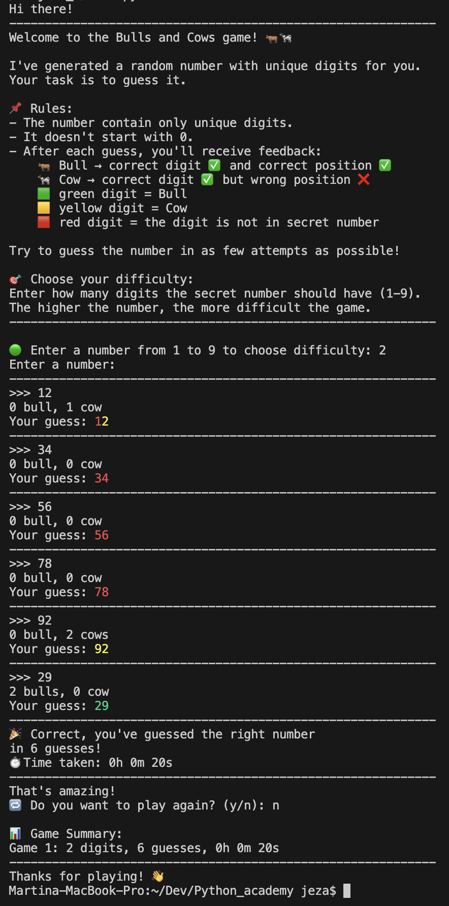

# 🎯 Bulls & Cows – druhý projekt Engeto Online Python Akademie

main.py: druhý projekt do Engeto Online Python Akademie
author: Martina Ježková
email: jezkova.m94@gmail.com
------------------------------------------------------------------------------

## SUMMARY: 
1. 📝 O PROJEKTU
2. 🧠 PRODUKTOVÝ POHLED 
3. 🚀 ROZŠÍŘENÍ OPROTI ZADÁNÍ
4. 🧪 UKÁZKA VÝSTUPU
5. 📁 SPUŠTĚNÍ
6. 🧾 ZADÁNÍ PROJEKTU - vychozí: from Engeto

------------------------------------------------------------------------------

## 1. 📝 O PROJEKTU:
Tento projekt je řešením zadání „Bulls and Cows“ ze studijního programu
Python Akademie od Engeto.  Cílem je vytvořit hru, ve které uživatel hádá 
náhodně vygenerované číslo s unikátními ciframi a dostává zpětnou vazbu 
pomocí tzv. **bulls** a **cows**.

## 📌 Pravidla hry
- Program vygeneruje tajné číslo, které:
  - má unikátní cifry,
  - nezačíná nulou.
- Uživatel zadává tipy a po každém tipování dostává:
  - 🐂 **Bull** → správná číslice na správné pozici.
  - 🐄 **Cow** → správná číslice, ale na jiné pozici.

- Program validuje vstup (číslice, délka, duplicity atd.).
- Cílem je uhodnout číslo v co nejméně pokusech.

------------------------------------------------------------------------------

## 2. 🧠 PRODUKTOVÝ POHLED: 
Tato verze hry Bulls & Cows byla navržena s důrazem na uživatelskou 
přívětivost, srozumitelnost a zábavný zážitek. Hráč je přirozeně veden 
celou hrou, a to i v případě, že se s tímto typem hry setkává poprvé.

**🔍 Klíčová vylepšení z pohledu použitelnosti:**

- 🗣️ **Vysvětlení principu hry** 
    – uživatel je seznámen s významem „bull“ a „cow“ i s pravidly.
- 🧩 **Možnost výběru obtížnosti** 
    – hráč si volí počet číslic (1–9), což přímo ovlivňuje náročnost.
- 🎨 **Barevná zpětná vazba na tip (pro uživatele Win, Linux a macOS)**
    - každá číslice je barevně označena podle výsledku:
       - 🟩 zelená = bull (správná číslice i pozice)
       - 🟨 žlutá = cow (správná číslice, ale jiná pozice)
       - 🟥 červená = číslice se v tajném čísle nenachází
- ⏱️ **Měření času** 
    – zobrazí se délka hraní každého kola.
- 📈 **Statistiky** 
    – počet pokusů a čas pro každou hru.
- 🔁 **Opakování hry** 
    – možnost plynule pokračovat bez restartu programu.

------------------------------------------------------------------------------

## 3. 🚀 ROZŠÍŘENÍ OPROTI ZADÁNÍ: 

- ⏱️ Výpočet a výpis času hraní každé hry.
- 📊 Uchování statistik všech odehraných her (počet pokusů, čas).
- 🎚️ Možnost nastavení počtu hádaných číslic podle výběru uživatele.
- 🎨 Barevné zvýraznění tipu uživatele

------------------------------------------------------------------------------

## 4. 🧪 UKÁZKA VÝSTUPU: 
Níže je příklad barevného výstupu z terminálu během hádání tajného čísla:


------------------------------------------------------------------------------

## 5. 📁 SPUŠTĚNÍ: 
1. Ujisti se, že máš nainstalovaný Python 3.10+
  ```bash 
  python --version
  ```bash

  nebo v některých systémech:
  ```bash 
  python3 --version
  ```bash

2. V terminalu/příkaz. řádku se přesuň do složky, kde máš uložené soubory
  z repozitáře https://github.com/MartinaJeza/Python_academy_Projekt_2.git
  ```bash 
  cd /cesta/k/projektu

#Virturální prostředí (volitelně, ale doporučeno) :
3. Vytvoř si virtuální prostředí:
    ```bash 
    python3 -m venv venv
    ```bash

4. Aktivuj prostředí: 
      macOS/Linux:
      ```bash 
      source venv/bin/activate
      ```bash

      Windows:
      ```bash 
      venv\Scripts\activate
      ```bash

#Instalace knihoven:
5. Nainstaluj požadované knihovny pomocí requirements.txt
    ```bash 
    pip install -r requirements.txt
    ```bash

#Spuštění hry:
6. Spusť hlavní soubor v terminálu/příkazovém řádku:
    ```bash 
    python main.py
    ```bash

#Ukončení hry:
7. Po ukončení práce deaktivuj virtuální prostředí
    ```bash 
    deactivate
    ```bash

------------------------------------------------------------------------------

## 6. 🧾 ZADÁNÍ PROJEKTU: 

Projekt : Bulls & Cows

Tvým úkolem bude vytvořit program, který by simuloval hru **Bulls and Cows**. 
Po vypsání úvodního textu uživateli, může hádání tajného čtyřciferného čísla 
začít.


**Program musí splňovat tyto požadavky:**
- Na úvod si svůj soubor popiš hlavičkou, ať se s tebou můžeme snadněji spojit:

"""
main.py: druhý projekt do Engeto Online Python Akademie

author: Petr Svetr
email: petr.svetr@gmail.com
"""
import ...

- program **pozdraví užitele a vypíše úvodní text** (viz. níže v ukázkách),
- program dále vytvoří tajné **4místné číslo** (číslice musí být unikátní 
  a nesmí začínat 0)
- hráč hádá číslo. 
- program jej upozorní, pokud zadá číslo **kratší nebo delší než 4 čísla**,
  pokud bude obsahovat duplicity, začínat nulou, příp. obsahovat nečíselné 
  znaky,
- program vyhodnotí tip uživatele,
- program dále vypíše počet bull/ bulls (pokud uživatel uhodne jak číslo, 
  tak jeho umístění), 
  příp. cows/ cows (pokud uživatel uhodne pouze číslo, ale ne jeho umístění).
  Vrácené ohodnocení musí brát ohled na jednotné a množné číslo ve výstupu. 
  Tedy 1 bull a 2 bulls (stejně pro cow/cows),
- zápis organizovaný **do krátkých a přehledných funkcí**.

Uložiště, nebo také repozitář, kam projekt odevzdáš, bude splňovat následující:
1. Tvoje řešení nahraješ do souboru main.py (pokud pojmenuješ soubor jinak, 
nebude uznaný),
2. repozitář bude obsahovat **jedinný .py soubor s výstupem** (pokud jej 
třeba rozdělíš 
jako main_1.py a main_2.py, nebude uznaný).
3. každý projekt **má svůj vlastní, oddělený repozitář** (zvlášť repozitář 
pro 1. projekt, zvlášť repozitář pro další projekt, ...).

**Úvodní text:**

Hi there!
-----------------------------------------------
I've generated a random 4 digit number for you.
Let's play a bulls and cows game.
-----------------------------------------------
Enter a number:
-----------------------------------------------

**Příklad hry s číslem 2017:**
Hi there!
-----------------------------------------------
I've generated a random 4 digit number for you.
Let's play a bulls and cows game.
-----------------------------------------------
Enter a number:
-----------------------------------------------
>>> 1234
0 bulls, 2 cows
-----------------------------------------------
>>> 6147
1 bull, 1 cow
-----------------------------------------------
>>> 2417
3 bulls, 0 cows
-----------------------------------------------
>>> 2017
Correct, you've guessed the right number
in 4 guesses!
-----------------------------------------------
That's amazing!

Program toho může umět víc. Můžeš přidat například:
1. **počítání času**, za jak dlouho uživatel uhádne tajné číslo
2. **uchovávat statistiky** počtu odhadů jednotlivých her


